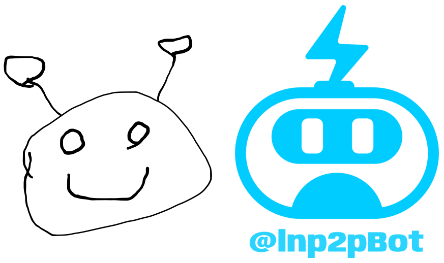

# For Support


**Good to know:** depending on the product you're building, it can be useful to explicitly document use cases. Got a product that can be used by a bunch of people in different ways? Maybe consider splitting it out!


| grafiquito |   |   |
| ---------- | - | - |
|            |   |   |
|            |   |   |
|            |   |   |











holis

holis expandible

